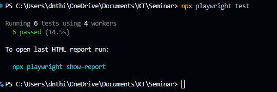

# Seminar User Guide: Web Automation Testing + Group 7
## Project Overview

**Course:** CSC15003 - Software Testing \
**Topic:** T02 - Web Automation Testing \
**Software Under Test (SUT):** [EShop](https://github.com/ttbhanh/eshop-sut/tree/main) (React + Node.js/Express) \
**Team Members:**

- 23127108 — Lê Hữu Minh Quang
- 23127307 — Nguyễn Phạm Minh Thư (Team Lead)
- 23127364 — Đặng Nguyễn Thành Hiếu
- 23127393 — Nguyễn Đăng Khoa


## Table of Contents

[1. Introduction](#1-introduction) \
[2. Installation and Setup](#2-installation-and-setup) \
[3. First Steps](#3-first-steps) \
[4. Advanced Usage](#4-advanced-usage) \
[5. Troubleshooting](#5-troubleshooting) \
[6. Failure Modes](#6-failure-modes) \
[7. References](#7-references) \
[8. AI Usage Disclosure](#8-ai-usage-disclosure)

## 1. Introduction

EShop's user-facing flows — login, browsing, cart, checkout — cover a large
chunk of its 22 functional requirements, and all of them run through the
browser. Manually re-checking these after every commit gets slow fast, which
is the problem web automation testing solves here.

This guide documents the hand-written Playwright baseline — installation through first tests — which the team used to cover FR-02, FR-07, and FR-08. Section 4 (Advanced Usage) also covers the AI-augmented comparison (GitHub Copilot Agent Mode + Playwright MCP) required by the seminar brief, contrasting locator strategy and assertion quality against the hand-written baseline. We also evaluated Selenium 4 and Cypress; Playwright's multi-browser support and built-in codegen/trace viewer made it the easiest to get running against EShop quickly. Full reasoning for this choice is in `Tool_Survey_Proposal.md` (Stage S1) — not repeated here.

Scope:
- Not a Playwright tutorial — see Section 7 for official docs.
- Covers what's specific to testing EShop, not generic Playwright usage.
- For teammates setting up their environment, seminar attendees, and anyone
  running the hand-written or AI-assisted test suites.

## 2. Installation and Setup

**Before you start**, you'll need:

- Node.js — version used by the team: v22.17.1, via nodejs.org or nvm
- npm (ships with Node.js — confirm with `npm -v`)
- Git, to clone both the EShop repo and this one
- OS tested by the team: Windows 11

**Getting EShop running locally:**

## 2.1 Starting the Backend Server

Backend supplies data and business logic; frontend-web is the React SPA that users interact with.

1. Open Terminal (Command Prompt / PowerShell / Terminal).
2. Move to folder `backend`:
```bash
   cd backend
```
3. Install dependencies:
```bash
   npm install
```
4. Initialize the database and seed data. Only run this command once for the first time or when you want to reset the data:
```bash
   node database.js
```
5. Start the server:
```bash
   node server.js
```
   *Terminal will display: `Server is running on http://localhost:3000`.*
   *(Note: You must keep this Terminal window open throughout the testing process).*

## 2.2 Starting the Frontend Web

Frontend is the main interface users use to shop online.

1. Open a new Terminal window.
2. Move to the `frontend-web` directory:
```bash
   cd frontend-web
```
3. Install dependencies:
```bash
   npm install
```
4. Start the Web application:
```bash
   npm run dev
```
   *Terminal will provide a URL (e.g., `http://localhost:5173/`). Click it or copy-paste into your browser to use.*

Before writing a single test, open a browser and confirm EShop responds at http://localhost:5173. A test that fails because the SUT itself isn't up will look identical to a real bug — worth ruling out first.

## 2.3 Installing Playwright

Run from `frontend-web/`:

```bash
npm init playwright@latest
```

When prompted, we chose:
- JavaScript
- default `tests/` folder (resolves to `frontend-web/tests/`)
- GitHub Actions workflow — optional, can be added later if CI gets set up
- install browsers — yes, this pulls Chromium, Firefox, and WebKit binaries
  (only Chromium is actually used for our test runs — see note below)

Sanity check:

```bash
npx playwright test
```

The bundled sample test should pass on Chromium — if it doesn't, don't move on to EShop-specific tests yet.

**Playwright is already wired to EShop** via `frontend-web/playwright.config.js`:
- `baseURL: 'http://localhost:5173'` — specs use relative paths instead of full URLs
- `webServer` auto-starts `npm run dev` if it's not already running
- `projects` is configured for **Chromium only**; Firefox and WebKit are commented out — the assignment only requires single-browser coverage, so we kept the suite scoped to Chromium

No manual setup needed here beyond having the backend running — just run `npx playwright test` once both servers are up.



## 3. First Steps

The walkthrough below starts from **FR-02 (Login + lockout)** and then reuses the authenticated session for **FR-07 (Add-to-Cart)** and **FR-08 (Checkout)**. This section is the **hand-written Playwright baseline** for the seminar. The MCP/Copilot workflow is still part of the project, but it belongs to the AI comparison track and is described separately in the note below.

*Team note: verify every selector against the real EShop markup using `npx playwright codegen`. EShop does not currently expose `data-testid` hooks for the main flows, and the login inputs are not wired to accessible labels, so Codegen may fall back to positional `getByRole('textbox').nth(n)` locators rather than `getByLabel()`.*

1. Get EShop running locally first (Section 2). Run all commands below from `frontend-web/`.
2. Rather than guessing selectors, record a starting point:
   `npx playwright codegen http://localhost:5173`
3. Click through the login form inside the recorder; it suggests locators live as you interact.
4. Move the generated steps into `frontend-web/tests/login-example.spec.js`. (This file is a teaching example for this guide; the team's full FR-02 suite — lockout, edge cases, and a security/escalation check — lives separately in `frontend-web/tests/fr02-login-A.spec.js`, `fr02-login-B.spec.js`, and `fr02-login-C.spec.js`, WAT-06.)
5. Swap out brittle CSS/XPath locators for the most stable locator available in the current markup: role, text, label, or test ID.
6. Shape the test around Arrange–Act–Assert. Because the login inputs are not linked to accessible labels in the current EShop markup, Codegen may fall back to positional `getByRole('textbox').first()` and `.nth(1)` locators rather than `getByLabel()`.
```js
   test.describe('FR-02: Login', () => {

   test('valid credentials log the user in', async ({ page }) => {
      await page.goto('/');
      await page.getByRole('link', { name: 'Đăng nhập' }).click();
      await page.locator('input[type="text"]').first().fill('test@eshop.com');
      await page.locator('input[type="text"]').nth(1).fill('Test1234!');
      await page.getByRole('button', { name: 'Sign In' }).click();
      await expect(page.getByText(/Chào,/)).toBeVisible();
   });

   test('invalid credentials show an error message', async ({ page }) => {
      await page.goto('/');
      await page.getByRole('link', { name: 'Đăng nhập' }).click();
      await page.locator('input[type="text"]').first().fill('23jadwj@gmail.com');
      await page.locator('input[type="text"]').nth(1).fill('123123232');
      await page.getByRole('button', { name: 'Sign In' }).click();

      await expect(page.getByText('Đăng nhập thất bại. Vui lòng kiểm tra lại.')).toBeVisible();
   });

   });
```
7. Run just this spec: `npx playwright test tests/login-example.spec.js`.
8. Re-run with `--headed` once to visually confirm it is clicking the right things, not just passing by accident.
9. This baseline stops at valid/invalid credentials on purpose. Lockout, parameterised cases, and a security/escalation check are already covered end-to-end in the team's official FR-02 suite (`fr02-login-A/B/C.spec.js`, WAT-06) — reproduce those separately rather than duplicating them here.
10. If you do extend this example, parameterising the login cases (a small data table instead of two near-duplicate `test()` blocks) keeps the assertions clearer.
11. Reuse the same authenticated state for FR-07 and FR-08 if you want the flow to stay focused on cart and checkout behaviour rather than re-testing login every time.
12. Run the full suite: `npx playwright test` (Chromium only, per project scope — see Section 2).
13. Check the report: `npx playwright show-report`.
14. Commit the spec and any test fixtures/data.
15. Note the run outcome (pass/fail, browser, duration) in `seminar/docs/team-log.md`.

**If you are reproducing the seminar's AI comparison track:** keep the baseline spec above, then open Copilot Agent Mode with the Playwright MCP server and let the agent draft or repair a separate version of the same flow from live browser state. Do not mix the MCP flow into the baseline checklist, because the seminar compares the two approaches side by side.

## 4. Advanced Usage

**Config file.** `playwright.config.js` keeps shared settings out of individual specs:

```js
export default defineConfig({
  timeout: 30_000,
  retries: process.env.CI ? 2 : 0,
  projects: [
    { name: 'chromium', use: { ...devices['Desktop Chrome'] } },
  ],
  use: {
    trace: 'on-first-retry',
    video: 'retain-on-failure',
  },
});
```

**Choosing locators.** Playwright's own guidance ranks locators roughly: role-based (`getByRole`) first, then text/label, then an explicit `data-testid`, with CSS/XPath as a fallback only. The reasoning: role- and label-based locators mirror what an actual user perceives on the page, so they tend to survive markup churn that would break a brittle selector chain.

**Running in parallel.** By default, Playwright's test runner spreads spec files across parallel workers. This starts to matter once flakiness measurement (WAT-13) needs many repeated runs — `--workers` controls how much concurrency to allow, which matters on a shared or resource-constrained CI runner.

**Reusing a login session.** Instead of logging in inside every single test, Playwright can save a signed-in browser state once (`storageState`) and reuse it. Faster suite, and one less place for the login flow itself to introduce flakiness into unrelated tests.

**When something fails.** `--debug` opens the Playwright Inspector for step-by-step execution. For failures that don't reproduce locally — usually CI-only — the trace viewer (`npx playwright show-trace`) replays DOM snapshots, network activity, and console output from the failed run, which is normally the fastest way in.

**AI-grounded workflow.** For the seminar's AI track, we used Copilot Agent
Mode together with Playwright MCP rather than blind code generation from
repository context alone. Grounding matters: an earlier blind-generation
attempt (WAT-15 "Attempt 1") produced a false negative — a test that passed
while the cart it claimed to verify was actually empty. Full breakdown of
that failure is in Section 6 (Failure Modes).

Redoing the same flow through Playwright MCP (`add-to-cart.ai-generated-2.spec.js`)
removed that specific failure: the agent observed the live DOM, saw the empty
cart after one click, and adapted before generating the final test. But the
MCP-derived draft still asserted `expect(page.getByText('iPhone 15 Pro Max')).toBeVisible()`
— a hardcoded product name and a containment check, not a row-count or
quantity check. It would pass even if catalog order changed or an extra row
leaked into the cart.

An audit pass (`add-to-cart.ai-audited.spec.js`) closed that second gap by
reading the product name dynamically, checking row count and quantity, and
adding a `waitForURL(/\/product\//)` guard — matching the hand-written
baseline (`add-to-cart.spec.js`, WAT-11) on robustness.

**Takeaway:** blind generation produces *correctness* false negatives — the
AI can't see the DOM, so it writes assertions that pass even on broken
behavior. Tool-grounded generation via MCP closes that gap but introduces a
different one — assertions tuned to "the one thing I just watched happen"
rather than the general invariant. Both AI paths still needed a human audit
pass to reach hand-written robustness. Full side-by-side in
`frontend-web/tests/ai-track/assertions-diff.md`.

# 5. Troubleshooting

| Error we hit | Root cause | How we fixed it |
|---|---|---|
| `Error: page.goto: Protocol error (Page.navigate): Cannot navigate to invalid URL` when running `login.spec.js` | Test file was saved outside `frontend-web/tests/`, the directory configured as `testDir` in `frontend-web/playwright.config.js` | Moved `login.spec.js` into `frontend-web/tests/`, matching `testDir: './tests'` |
| Two separate `playwright.config.js` files existed early in the project — one at the repo root, one inside `frontend-web/` — because login tests and cart/checkout tests were started independently by different team members | The root config was leftover scaffolding from an early `npm init playwright@latest` run and was never actually wired to the app (its `webServer` pointed at the wrong port and was commented out) | Consolidated everything into a single project: all specs moved into `frontend-web/tests/`, root `playwright.config.js` and root `tests/` deleted, root `metrics/flakiness.md` name conflict resolved separately (see `flakiness-concurrency.md`) |
| `Error: locator.click: Error: strict mode violation: getByRole('button', { name: 'Thêm vào giỏ' }) resolved to 6 elements` when clicking an "add to cart" button on the Home page | The role/text locator matched every identical button on the page — one per product card — instead of a single intended one | Scoped the locator to one product card first (e.g. `.first()` or a parent-card selector) before calling `.click()`; see the fuller write-up in Section 6 |

**A note on project structure, for anyone confused by earlier commits:** this
repository now has a **single Playwright project**, driven by
`frontend-web/playwright.config.js`. All specs — login (FR-02), cart (FR-07),
checkout (FR-08), and the AI-track suites — live under `frontend-web/tests/`.
Earlier in the project there were two separate configs (root and
`frontend-web/`) because login was set up independently from cart/checkout;
that split has since been removed. If you see a `tests/` folder or
`playwright.config.js` at the repo root in an old commit or branch, it is
leftover from that period and should not be used — run everything from
`frontend-web/`.

## 6. Failure Modes

Ways this tooling can produce a misleading result rather than a clean pass/fail — sourced from official docs/vendor material where applicable, and from direct observation during our own AI-track experiments.

- **Auto-wait can hide a real problem behind a passing test.** Playwright retries web-first assertions until an element becomes visible or stable ([Playwright docs — Auto-waiting](https://playwright.dev/docs/actionability)), which cuts down on flakiness — but a genuinely slow or partially-broken loading state can still end in a green test, as long as the element shows up before the timeout expires. Worth pairing functional assertions with an explicit timing check wherever load speed actually matters to the requirement.

- **Self-healing locators can lock onto the wrong element without anyone noticing.** Auto-heal tools like Mabl or Testim pick the closest attribute match when the original locator breaks, rather than confirming the underlying intent still holds. A restructured or renamed element can get "healed" successfully while the test quietly stops verifying what it was originally meant to check — and the suite stays green throughout. Mabl's own docs log a confidence score per auto-heal for exactly this reason ([mabl help — How auto-heal works](https://help.mabl.com/hc/en-us/articles/19078583792404-How-auto-heal-works)); periodically reviewing that log matters more than trusting an all-green run.

- **Blind AI generation can produce a false negative — a test that passes while the flow it claims to verify is actually broken.** Given only a plain-language scenario for FR-07 (log in → add a product → check it's in the cart) and no access to the underlying components, an AI assistant reasonably wrote the last step as `page.goto('/cart')` followed by a URL check only — a sensible reading of "go to my cart," but one that stops short of the scenario's actual ask ("check that the product I added is there"). The test passed, yet the cart was empty for two independent reasons the assertion never looked for: `ProductDetail.jsx` swallows the first "add to cart" click by design, and `page.goto()` forces a full page reload that wipes the in-memory `CartContext` regardless. Neither bug was visible to a tool that only reasons over the scenario text and never inspects the DOM after acting (WAT-15, Attempt 1). *This is a distinct failure mode from the over-fitting problem discussed in Section 4 — that one is a tool-grounded (MCP) draft under-specifying assertions after confirming a real success; this one is an ungrounded draft asserting the wrong layer (navigation, not state) and missing a real failure entirely. The same WAT-15 log documents both, across two attempts.*

- **EShop's login form has no accessible labels on its inputs.** *Trigger:* running Codegen against the real login form. *Symptom:* Playwright can't produce a `getByLabel()` locator for the Email/Password fields, and falls back to positional locators (`getByRole('textbox').first()`, `.nth(1)`) instead. *Detection:* visible immediately in the Codegen output — no label-based locator is offered at all. *Mitigation:* either add `aria-label` / `<label for>` attributes to the EShop form (a frontend fix outside this team's scope), or accept the positional locator with a comment flagging it as fragile, and re-verify it whenever the form's field order changes.

- **Network throttling against the Vite dev server can make navigation itself the failure, not the flow under test (WAT-13).** *Trigger:* emulating a constrained connection (CDP `Network.emulateNetworkConditions`, ~400–600ms latency / 300–500kbps) against `npm run dev`, rather than a production build. *Symptom:* `page.goto()` throws `Test timeout of Xms exceeded... navigating to ".../login", waiting until "load"` — the test never gets past its first line, before any flow-specific action runs. *Detection:* reproduced twice independently on this project — once in the WAT-13 investigation (6/6 consecutive runs failed identically at 45s) and once by the team's own `frontend-web/tests/ai-track/helpers/network-throttle.js` (its header comment documents the same dev-server timeout, which is why that helper settled on a lighter "Fast 3G"-like profile instead of "Slow 3G"). *Mitigation:* point throttled tests at a production build (`vite build` + `vite preview`) instead of the dev server — dev mode serves ~90 unbundled ES module requests per page load, so per-request latency compounds across the whole module graph, whereas production ships 2 bundled files; that is what an actual throttled *user* experiences, not an artifact of the dev toolchain.

- **Ambiguous locators fail loudly with a strict-mode violation, rather than silently acting on the first match (WAT-18).** *Trigger:* calling an action on a `getByRole`/`getByText` locator that resolves to more than one element — e.g. `page.getByRole('button', { name: 'Thêm vào giỏ' })` on the Home page, which renders one identical button per product card. *Symptom:* `Error: locator.click: Error: strict mode violation: getByRole(...) resolved to N elements`, listing every matching instance. *Detection:* hit directly by the team in `add-to-cart.ai-audited.spec.js`, where `locator('h1').innerText()` briefly matched Home's 2 `<h1>` elements during a mid-navigation race (see `metrics/flakiness.md` (root — WAT-18)). *Mitigation:* scope locators to a specific container before matching on text/role (`.first()`, parent scoping, or a more specific accessible name), and treat a strict-mode error as a signal to make the target unambiguous — not as a reflex to reach for `.first()` without checking why multiple matches exist (in the ai-audited case the real fix was waiting for navigation, not just accepting the first stale match).

- **A test-level timeout with no headroom over the sequential baseline flakes once real concurrency is added (WAT-13).** *Trigger:* running FR-07 (Add-to-Cart) against a **production build** (`vite build && vite preview`, not the dev server) with real parallelism (`--repeat-each=10 --workers=10` on an 8-core machine) against one shared backend process (single Node event loop, single `sqlite3` connection) — CPU-contended Chromium instances plus backend request queuing pushed total run time from a tight ~6.4–7.3s (sequential, 0/10 flakes) to a 7.8–11.6s spread. *Symptom:* `Error: Test timeout of 10000ms exceeded` — not tied to any specific assertion; the whole test is killed once elapsed time crosses the configured limit. *Detection:* reproduced and quantified in `frontend-web/metrics/flakiness-concurrency.md` (WAT-13, FR-07-specific): 0/10 flake rate sequential vs 5/10 flake rate under 10-way concurrency, identical throttle profile and timeout. This is a separate finding from the FR-08 checkout flake in the root `metrics/flakiness.md` — different flow, different stress dimension. *Mitigation:* size timeouts against the *concurrent* p95, not the sequential one (≥3x the observed tail); cap parallel workers at or below the logical core count for throttled/CPU-heavy suites; reduce shared-backend contention directly (connection pooling / WAL mode) if concurrent throttled runs are part of the standard CI profile.

Giờ 6 bullet, không trùng ý nữa. Gửi tiếp phần 7 (References) khi sẵn sàng.

## 7. References

- Playwright Team — *Best Practices*, official Playwright documentation. https://playwright.dev/docs/best-practices
- Playwright Team — *Actionability (Auto-waiting)*, official Playwright documentation. https://playwright.dev/docs/actionability
- Playwright Team — *Test Agents*, official Playwright documentation. https://playwright.dev/docs/test-agents
- Microsoft — *playwright-mcp*, official repository. https://github.com/microsoft/playwright-mcp
- Bach, J. (1999) — *Test Automation Snake Oil*, v2.1, Satisfice, Inc. https://www.satisfice.com/download/test-automation-snake-oil
- mabl — *How Auto-Heal Works*, mabl Help Center. https://help.mabl.com/hc/en-us/articles/19078583792404-How-auto-heal-works
- Selenium Project — *Locator Strategies: Relative Locators*, official Selenium documentation. https://www.selenium.dev/documentation/webdriver/elements/locators/


## 8. AI Usage Disclosure

This guide was drafted with the assistance of Claude (Anthropic), used as an editing and cross-checking tool over content the team had already produced (test files, WAT tickets, `flakiness.md`, `flakiness-concurrency.md`, team logs). This is separate from the AI-augmented *testing* track (GitHub Copilot Agent Mode + Playwright MCP) discussed in Sections 4 and 6, which is the subject of the seminar itself, not the tool used to write about it.

**What the AI assistance did:**
- Rewrote several early drafts to cut AI-sounding filler phrasing and tighten prose (Section 1).
- Flagged an internal inconsistency between the Introduction's framing and how much of the AI-augmented track the guide actually documents, prompting a rewrite of the relevant sentence.
- Cross-checked path references (e.g. `frontend-web/tests/...` vs. stale `tests/...` paths) against the project's actual folder structure after the test-file relocation, and caught several examples that still pointed at pre-refactor locations.
- Caught a missing `import { test, expect } from '@playwright/test'` in a code sample that would not have run as pasted.
- Caught a command (`--project=firefox`) that referenced a browser project no longer defined in the shipped config, which would have failed if followed literally.
- Helped restructure the Failure Modes section, including separating narrative "notes" from actionable numbered steps in Section 3, and applying a consistent Trigger/Symptom/Detection/Mitigation format to entries backed by reproducible logs.

**What the AI assistance did not do:**
- It did not generate the underlying test results, flakiness numbers, or root-cause findings — those came from the team's own `flakiness.md`, `flakiness-concurrency.md`, WAT-13/WAT-15/WAT-18 investigation logs, and direct test runs.
- It did not decide tool scope (e.g., Chromium-only coverage, which flows to automate) — those were team/assignment decisions, confirmed against the T02 topic brief before being written up.

**Errors caught during review (kept here for transparency, not just credit):**
- One AI-drafted citation incorrectly attributed the strict-mode-violation finding to WAT-13; cross-checking against `flakiness-concurrency.md` showed the finding actually belongs to WAT-18 (`flakiness.md`), and the guide was corrected accordingly.
- One AI-drafted Failure Modes bullet cited a supporting file (`strict-mode-violation-repro.spec.js`) that does not exist in the repository; it was removed rather than left in as unverifiable evidence.
- The Mabl auto-heal confidence-score claim in Section 6 was verified against Mabl's official documentation and a citation link was added; the original draft had made the claim without a source.
- Every numeric claim reused from `flakiness.md` and `flakiness-concurrency.md` (run counts, durations, flake rates, request counts) was checked against those source files before being kept in this guide.

Every section above was reviewed, corrected, and approved by the team before submission; no AI-generated text was pasted in without a human read-through and, where needed, a fact-check against the project's own logs and test files.